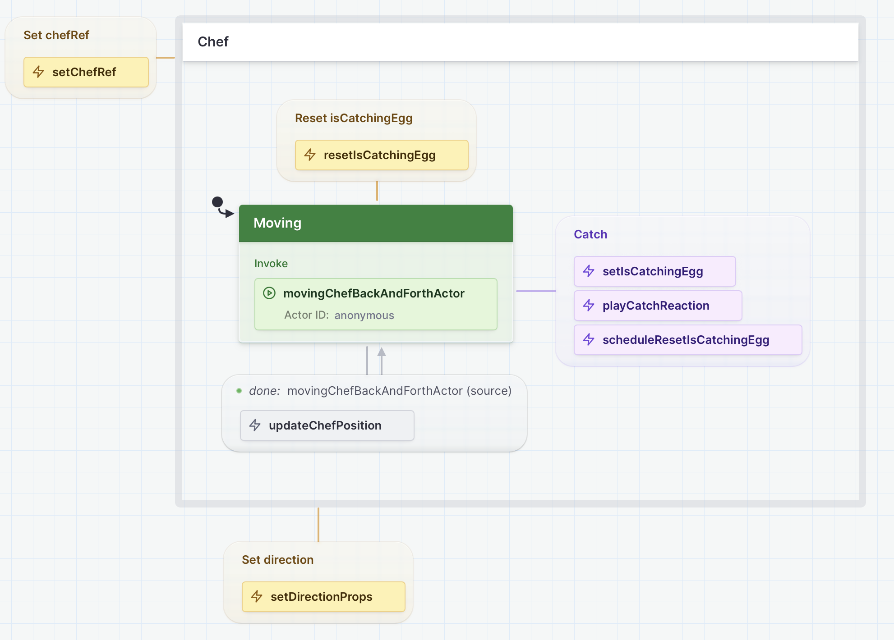
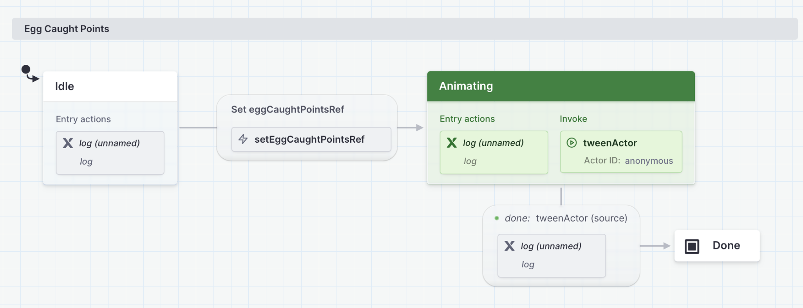

# Egg Drop Game 🥚

[](https://react.dev)
[](https://www.typescriptlang.org)
[](https://vitejs.dev)
[](https://xstate.js.org)
[](https://konvajs.org)
[](https://howlerjs.com)

[](http://eggdrop.kevinmaes.com)

🎮 [Play the Egg Drop game](http://eggdrop.kevinmaes.com)

## 📖 About the Game

Egg Drop is a fun web-based game where you control Chef Rafi who tries to catch eggs dropped by hens to make his egg drop soup. It was inspired by the old [Atari 2600 game, Kaboom](https://www.atarimania.com/pgesoft.awp?soft=7179). Additionally, this version of game features a genetic algorithm that evolves the characteristics of the hens over time, making each playthrough unique and progressively challenging.

## ✨ Features

| 🎮 Gameplay               | 🧬 Evolution          | 🎯 Challenge            |
| ------------------------- | --------------------- | ----------------------- |
| Catch eggs with Chef Rafi | Hens evolve over time | Increasing difficulty   |
| Dynamic movement patterns | Genetic algorithm     | Unique each playthrough |

### 🎤 Conference Presentations

This project was originally created as a demo for my talk, "Evolving Game Development with Genetic Algorithms" that was delivered at:

- [What The Stack](https://wts.sh) - Skopje, North Macedonia, September 14, 2024 | [Slides](https://noti.st/kvmaes/k4mqD6/evolving-game-development-with-genetic-algorithms)
- [React Alicante](https://reactalicante.es) - Alicante, Spain, September 21, 2024 | [Slides](https://noti.st/kvmaes/cLmMPq/evolving-game-development-with-genetic-algorithms) | [Video](https://youtu.be/b2TJoNDQ1co)
- [CityJS Athens](https://greece.cityjsconf.org) - Athens, Greece, November 29, 2024

## 🚀 Getting Started

### Prerequisites

- [Node.js](https://nodejs.org/) (v18 or higher recommended)
- [Yarn](https://yarnpkg.com/) package manager

### Installation

1. Clone the repository:

   ```bash
   git clone https://github.com/kevinmaes/eggdrop.git
   cd eggdrop
   ```

2. Install dependencies:

   ```bash
   yarn install
   ```

3. Start the development server:

   ```bash
   yarn dev
   ```

4. Open your browser and navigate to:
   ```
   http://localhost:5173
   ```

## 🛠️ Development Commands

| Command        | Description                                              |
| -------------- | -------------------------------------------------------- |
| `yarn dev`     | Start the development server                             |
| `yarn build`   | Build the production-ready app                           |
| `yarn preview` | Preview the production build locally                     |
| `yarn tsc`     | Run TypeScript type checking                             |
| `yarn lint`    | Run ESLint to check for code issues                      |
| `yarn test`    | Run unit tests                                           |
| `yarn ci`      | Run CI checks locally (lint, type check, test)           |
| `yarn check`   | Run comprehensive checks (lint, type check, test, build) |

## 🧪 End-to-End Testing

The game uses [Playwright](https://playwright.dev) for end-to-end testing. These tests verify the game's functionality by simulating real user interactions and checking the game state.

### Running Tests

```bash
# Run tests in headless mode
yarn test:e2e

# Run tests with browser visible
yarn test:e2e:headed

# Run tests in debug mode
yarn test:e2e:debug
```

### Test Architecture

The tests leverage the game's state machines through a special test API that's enabled when running in test mode. This approach overcomes several challenges typically associated with testing Canvas-based games:

1. **Canvas Testing Challenges**: Traditional Canvas applications are notoriously difficult to test because:

   - Canvas elements don't have a DOM representation to query
   - Visual state is not directly accessible through standard DOM APIs
   - Game state is often scattered across multiple components and render cycles
   - Animation frames make it hard to assert on exact positions and states

2. **State Machine Solution**: By using XState state machines, we can:

   - Access game state directly through the state machine's context
   - Query exact positions and velocities of game elements
   - Monitor state transitions and side effects
   - Make assertions about game state without relying on visual inspection

3. **Test API**: When the game runs with `?testMode=true`, it exposes a `window.__TEST_API__` object that provides access to:

   - State machine actor references (app, chef, gameLevel)
   - Convenience getters for game state (score, chef position, etc.)
   - Direct event sending to state machines

4. **State Machine Integration**: Tests can:

   - Query the current state of any machine using `getSnapshot()`
   - Send events to machines using `send()`
   - Monitor state transitions and side effects
   - Assert on exact positions, velocities, and game state

5. **Game Automation**: Tests can simulate:
   - Keyboard input for chef movement
   - Game state transitions (start, pause, game over)
   - Score tracking and game progression
   - Complex game scenarios that would be difficult to test visually

This architecture makes it possible to write reliable, deterministic tests for a Canvas-based game, something that would be much more challenging with traditional testing approaches.

### Viewing Test Results

#### Local Results

After running tests, you can view the HTML report:

```bash
# Open the last test report
yarn test:e2e:report
```

#### GitHub Actions Results

When tests run in GitHub Actions:

1. Navigate to the Actions tab in your PR
2. Click on the workflow run
3. Scroll to the "Artifacts" section
4. Download and open the `playwright-report` to view detailed test results

The report includes:

- Test execution videos
- Screenshots at each step
- Detailed error messages and stack traces
- Test duration and performance metrics

## 🧪 CI/CD Pipeline

This project uses GitHub Actions for Continuous Integration. The CI workflow:

1. Runs on all Pull Requests to the `main` branch
2. Verifies code quality with TypeScript and ESLint checks
3. Ensures all tests pass before merging
4. Confirms the build process works correctly

You can run these checks locally before pushing with:

```bash
yarn ci
```

## 🧰 Technology Stack

### Core Technologies

- **[React](https://react.dev)** - UI library for building the game interface
- **[TypeScript](https://www.typescriptlang.org)** - Type-safe JavaScript for robust code
- **[Vite](https://vitejs.dev)** - Fast build tool and development server

### Game Development Libraries

- **[Konva](https://konvajs.org)** - Canvas library for 2D graphics and animations
- **[React Konva](https://konvajs.org/docs/react/index.html)** - React integration for Konva
- **[XState](https://xstate.js.org)** - State management using state machines and the actor model
- **[Howler](https://howlerjs.com)** - Audio library for game sounds

## State Machines

Several XState state machines are used throughout the game:

- Application (loading and overall coordination)
- Game Play (levels)
- [Chef](#chef-machine) - Player character controlled by the user
- Hen
- Egg (hatching into chicks)
- [Egg Points](#egg-caught-points-machine) - Points won when catching an egg
- Sounds

### Chef machine

[](https://stately.ai/registry/editor/3a22c0b6-a102-448a-b09b-2f118d881d53?machineId=6e326602-d929-4a40-b57a-d4cf067b6442)

### Egg Caught Points machine

[](https://stately.ai/registry/editor/3a22c0b6-a102-448a-b09b-2f118d881d53?mode=design&machineId=67ee088f-7005-4919-a155-673965bfef40)

## 🧬 Genetic Algorithm

The game features a genetic algorithm that evolves the characteristics of the hens who drop eggs. Each hen (referred to as a "Hendividual") has DNA composed of traits related to:

- Movement patterns and speed
- Egg-laying frequency and timing
- Other behavioral characteristics

As the game progresses, hens evolve based on their performance, creating a dynamic and increasingly challenging gameplay experience.

## 🔧 Developer Tools

### Dev Panel

The game includes a developer panel to track statistics related to the genetic algorithm:

- Press `cmd-d` (Mac) or `ctrl-d` (Windows/Linux) to toggle the Dev Panel visibility
- Monitor hen population statistics and evolution metrics
- Track game performance and state

### Project Structure

```
eggdrop/
├── public/               # Static assets (images, sounds, fonts)
├── src/                  # Source code
│   ├── App.tsx           # Main application component
│   ├── app.machine.ts    # Main state machine
│   ├── Hen/              # Hen components and logic
│   ├── Egg/              # Egg components and logic
│   ├── Chef/             # Chef (player) components
│   ├── GameLevel/        # Level management
│   ├── geneticAlgorithm/ # Genetic algorithm implementation
│   ├── DevPanel/         # Developer panel components
│   └── ...               # Other components and utilities
├── package.json          # Dependencies and scripts
└── vite.config.ts        # Vite configuration
```

## 🎨 Asset Creation Tools

The following tools were used to create game assets:

- **[ChatGPT](https://openai.com/index/chatgpt/)** - Character image generation
- **[Logoist 5](https://www.syniumsoftware.com/logoist)** - Vector graphics and animation alignment
- **[Texture Packer](https://www.codeandweb.com/texturepacker)** - Sprite sheet creation
- **[Audacity](https://www.audacityteam.org)** - Audio recording and editing

## 🚧 Development Status

**THIS GAME IS STILL IN ACTIVE DEVELOPMENT**

See the [Issues](https://github.com/kevinmaes/eggdrop/issues) for a list of upcoming features, fixes, and enhancements.

Current limitations:

- No instructions screen
- No defined end-game condition
- Genetic algorithm still being refined

## 🤝 Contributing

Contributions are welcome! Please feel free to submit a Pull Request.

1. Fork the repository
2. Create your feature branch (`git checkout -b feature/amazing-feature`)
3. Commit your changes (`git commit -m 'Add some amazing feature'`)
4. Push to the branch (`git push origin feature/amazing-feature`)
5. Open a Pull Request

## 📝 License

This project is licensed under the MIT License - see the LICENSE file for details.

## 📬 Contact

Kevin Maes - [@kvmaes](https://twitter.com/kvmaes)
