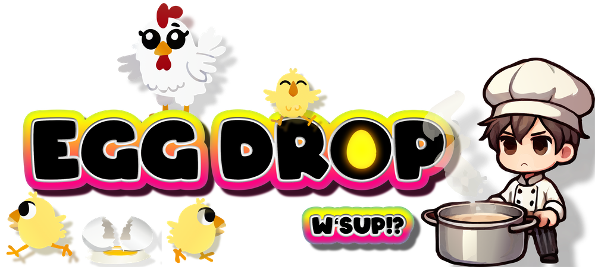

# Egg Drop Game 🥚

[](https://react.dev)
[](https://www.typescriptlang.org)
[](https://vitejs.dev)
[](https://xstate.js.org)
[](https://konvajs.org)
[](https://howlerjs.com)

[](https://eggdrop.kevinmaes.com)

🎮 [Play the Egg Drop game](http://eggdrop.kevinmaes.com)

## 📖 About the Game

Egg Drop is a fun web-based game where you control Chef Rafi who tries to catch eggs dropped by hens to make his egg drop soup. It was inspired by the old [Atari 2600 game, Kaboom](https://www.atarimania.com/pgesoft.awp?soft=7179). Additionally, this version of game features a genetic algorithm that evolves the characteristics of the hens over time, making each playthrough unique and progressively challenging.

### 🎤 Conference Presentations

This project was originally created as a demo for my talk, "Evolving Game Development with Genetic Algorithms" that was delivered at:

- [What The Stack](https://wts.sh) - Skopje, North Macedonia, September 14, 2024 | [Slides](https://noti.st/kvmaes/k4mqD6/evolving-game-development-with-genetic-algorithms)
- [React Alicante](https://reactalicante.es) - Alicante, Spain, September 21, 2024 | [Slides](https://noti.st/kvmaes/cLmMPq/evolving-game-development-with-genetic-algorithms) | [Video](https://youtu.be/b2TJoNDQ1co)
- [CityJS Athens](https://greece.cityjsconf.org) - Athens, Greece, November 29, 2024

## 🚀 Getting Started

### Prerequisites

- [Node.js](https://nodejs.org/) (v18 or higher recommended)
- [Yarn](https://yarnpkg.com/) package manager

### Installation

1. Clone the repository:

   ```bash
   git clone https://github.com/kevinmaes/eggdrop.git
   cd eggdrop
   ```

2. Install dependencies:

   ```bash
   yarn install
   ```

3. Start the development server:

   ```bash
   yarn dev
   ```

4. Open your browser and navigate to:
   ```
   http://localhost:5173
   ```

## 🛠️ Development Commands

| Command        | Description                                              |
| -------------- | -------------------------------------------------------- |
| `yarn dev`     | Start the development server                             |
| `yarn build`   | Build the production-ready app                           |
| `yarn preview` | Preview the production build locally                     |
| `yarn tsc`     | Run TypeScript type checking                             |
| `yarn lint`    | Run ESLint to check for code issues                      |
| `yarn test`    | Run unit tests                                           |
| `yarn ci`      | Run CI checks locally (lint, type check, test)           |
| `yarn check`   | Run comprehensive checks (lint, type check, test, build) |

## 🧪 CI/CD Pipeline

This project uses GitHub Actions for Continuous Integration. The CI workflow:

1. Runs on all Pull Requests to the `main` branch
2. Verifies code quality with TypeScript and ESLint checks
3. Ensures all tests pass before merging
4. Confirms the build process works correctly

You can run these checks locally before pushing with:

```bash
yarn ci
```

## 🧰 Technology Stack

### Core Technologies

- **[React](https://react.dev)** - UI library for building the game interface
- **[TypeScript](https://www.typescriptlang.org)** - Type-safe JavaScript for robust code
- **[Vite](https://vitejs.dev)** - Fast build tool and development server

### Game Development Libraries

- **[Konva](https://konvajs.org)** - Canvas library for 2D graphics and animations
- **[React Konva](https://konvajs.org/docs/react/index.html)** - React integration for Konva
- **[XState](https://xstate.js.org)** - State management using state machines and the actor model
- **[Howler](https://howlerjs.com)** - Audio library for game sounds

## 🧬 Genetic Algorithm

The game features a genetic algorithm that evolves the characteristics of the hens who drop eggs. Each hen (referred to as a "Hendividual") has DNA composed of traits related to:

- Movement patterns and speed
- Egg-laying frequency and timing
- Other behavioral characteristics

As the game progresses, hens evolve based on their performance, creating a dynamic and increasingly challenging gameplay experience.

## 🔧 Developer Tools

### Dev Panel

The game includes a developer panel to track statistics related to the genetic algorithm:

- Press `cmd-d` (Mac) or `ctrl-d` (Windows/Linux) to toggle the Dev Panel visibility
- Monitor hen population statistics and evolution metrics
- Track game performance and state

### Project Structure

```
eggdrop/
├── public/               # Static assets (images, sounds, fonts)
├── src/                  # Source code
│   ├── App.tsx           # Main application component
│   ├── app.machine.ts    # Main state machine
│   ├── Hen/              # Hen components and logic
│   ├── Egg/              # Egg components and logic
│   ├── Chef/             # Chef (player) components
│   ├── GameLevel/        # Level management
│   ├── geneticAlgorithm/ # Genetic algorithm implementation
│   ├── DevPanel/         # Developer panel components
│   └── ...               # Other components and utilities
├── package.json          # Dependencies and scripts
└── vite.config.ts        # Vite configuration
```

## 🎨 Asset Creation Tools

The following tools were used to create game assets:

- **[ChatGPT](https://openai.com/index/chatgpt/)** - Character image generation
- **[Logoist 5](https://www.syniumsoftware.com/logoist)** - Vector graphics and animation alignment
- **[Texture Packer](https://www.codeandweb.com/texturepacker)** - Sprite sheet creation
- **[Audacity](https://www.audacityteam.org)** - Audio recording and editing

## 🚧 Development Status

**THIS GAME IS STILL IN ACTIVE DEVELOPMENT**

See the [Issues](https://github.com/kevinmaes/eggdrop/issues) for a list of upcoming features, fixes, and enhancements.

Current limitations:

- No instructions screen
- No defined end-game condition
- Genetic algorithm still being refined

## 🤝 Contributing

Contributions are welcome! Please feel free to submit a Pull Request.

1. Fork the repository
2. Create your feature branch (`git checkout -b feature/amazing-feature`)
3. Commit your changes (`git commit -m 'Add some amazing feature'`)
4. Push to the branch (`git push origin feature/amazing-feature`)
5. Open a Pull Request

## 📝 License

This project is licensed under the MIT License - see the LICENSE file for details.

## 📬 Contact

Kevin Maes - [@kvmaes](https://twitter.com/kvmaes)

Project Link: [https://github.com/kevinmaes/eggdrop](https://github.com/kevinmaes/eggdrop)
